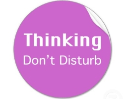

La créativité est un terme très à la mode en ce moment. Tout le monde veut être créatif, plus créatif, et rassurez-vous tout le monde le peut ! Il suffit de s'en donner les moyens.

Cet article sera une sorte de traduction de [cette vidéo](/archives/la-creativite-selon-john-cleese), y explique sa vision de la créativité, et comment il en repousse les limites.

## Laissez votre inconscient travailler !

### Dormez sur vos problèmes

À trop réfléchir sur un problème précis, on perd souvent une vision globale indispensable à sa résolution. Dans ces conditions, la créativité est totalement bridée car on reste fixé sur un point particulier, qui parfois n'est pas directement source de problème, et encore moins d'inspiration.

Pour éviter cela, le but est de s'écarter du problème pour mieux le cerner. Mais qu'est-ce que signifie dormir sur un problème ? C'est une manière de laisser travailler votre inconscient à votre place, sachant qu'il est généralement très efficace. Et un des moyen les plus efficaces est le sommeil. Ça ne vous est jamais arrivé de passer 3 heures à tenter de trouver une solution, en vain, d'aller vous coucher, et de vous réveiller miraculeusement avec la solution ? C'est ce que j'entends ici par dormir sur un problème.

Bien sûr, le sommeil n'est pas l'unique solution. Certains préféreront faire les cent pas, aller faire un jogging, etc. Mais l'idée est la même : sortez du cadre, pensez à autre chose, et laissez votre inconscient travailler pour vous !

### Attendez ! Ce n'est pas fini !

Vous venez de terminer un projet, écrit un livre, une musique, construit un meuble ou quoique ce soit d'autre. Eh bien recommencez !

Bon, je l'admet, c'est un peu extrême ! Mais sachez que cet inconscient qui vous a déjà aidé à résoudre quelques problèmes, continue à travailler... Il corrige, synthétise votre travail sans même que vous vous en rendiez compte, et il est quasiment sûr que si vous recommencez votre création de zéro, elle sera plus aboutie, plus claire, propre.

Ceci étant dit, on ne peut évidemment pas passer sa vie à recommencer chacun des projets que l'on entreprend... Mais si par exemple vous êtes bloqué à la moitié de votre travail, il vaut parfois mieux tout recommencer. De cette manière, vous repartez sur des bases saines et vous finirez finalement plus vite, et mieux.

## Fixez vous des limites

Il est important de vous créer un cocon bien défini pour laisser parler votre créativité. Il vous faut donc définir des limites pour vous séparer du stress et de toutes perturbations. Il paraît impossible d'entreprendre de créer quelque chose en pensant aux rendez-vous de la journée, aux courses du soir ou même à un autre projet en parallèle.

_Choisissez un lieu_. Peut importe ou vous travaillez, il est préférable de garder ce même lieu tout le temps. Cela procure un sentiment de confort : que vous soyez très organisé ou totalement bordéliques, vous êtes en sécurité, tranquille.

Tout aussi important, _fixez vous des limites de temp_s. De cette manière vous vous habituez à déballer toute votre créativité durant cette période.

Avec ces deux limites toutes simples, vous avez maintenant toutes les armes pour créer en toutes sérénité !

L'interruption est une des pires choses qui puisse arriver durant un processus de création. Cela casse totalement le flux de vos pensées, qui est très difficile à retrouver par la suite. C'est entre autres pour cela qu'il est indispensable de se fixer des limites de temps et de lieu. Alors que vous travailliez chez vous ou à un bureau, prévenez votre entourage pour éviter une quelconque perturbation pendant votre période de création.

## Allez voir ailleurs !

> Les bons artistes copient, les grands artistes volent.  
> Pablo Picasso

La créativité se cultive au quotidien ! Vous avez réellement intérêt à aller voir ce qui se fait ailleurs pour y trouver de l'inspiration. Mais ne vous limitez pas à vote milieu professionnel !  
Vous êtes musicien ? Allez voir un architecte !  
Vous êtes architecte ? Allez voir un cordonnier !

En vous confrontant à des milieux totalement différents du vôtre, vous y trouverez des choses à réinventer à votre manière, vous y trouverez votre originalité.