Voilà quelques photos de ma dernière guitare en date, qui porte le doux nom de Brigitte ! J'en ai perdu quelques unes, donc je ne pourrais pas vous montrer toutes les étapes de fabrication, mais il y a déjà de quoi se faire une idée.

Tête, avec incrustation et cache pour la tige de réglage.

## Les plans

Idée originale, un vieux dessin de 2006.

  

Début de plan, sur base d’Ibanez RG et Les Paul.

  

  

Plan du corps

  

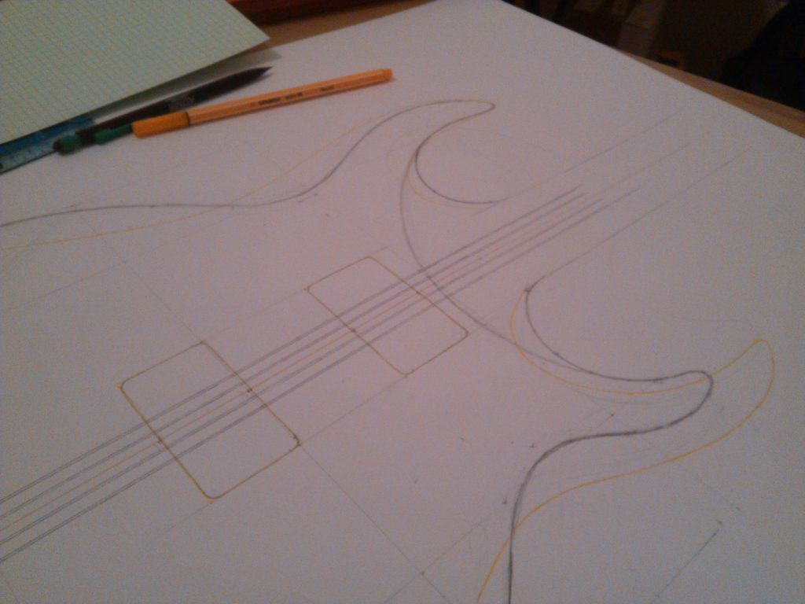

Détail du plan sur la jonction du manche

  

Plan du corps à côté de l’idée originale.

  

Plan du corps

  

Détail du plan sur la chambre pour l’électronique.

  

Détail du plan sur la chambre pour l’électronique.

  

Détail du plan de la cavité pour l’électronique.

  

Plan du chevalet.

  

Plan en coupe du corps pour un chanfrein au niveau de l’avant-bras, similaire aux stratocaster.

  

Plan en coupe de la courbure de la table.

  

Dessin d’une idée pour les repères de la touche.

  

Plan de la tête.

  

Plan en coupe du manche et de la tête.

  

Logo « Brigitte » pour la tête.

  

  

## Les bois

Le colis de bois « muy frágil »

  

Les bois du corps et du manche, padouk et érable ondé.

  

Les bois arrangés comme la future guitare

  

Bois pour la tête.

  

## Le manche

Arrangement des bois pour les plis du manche.

  

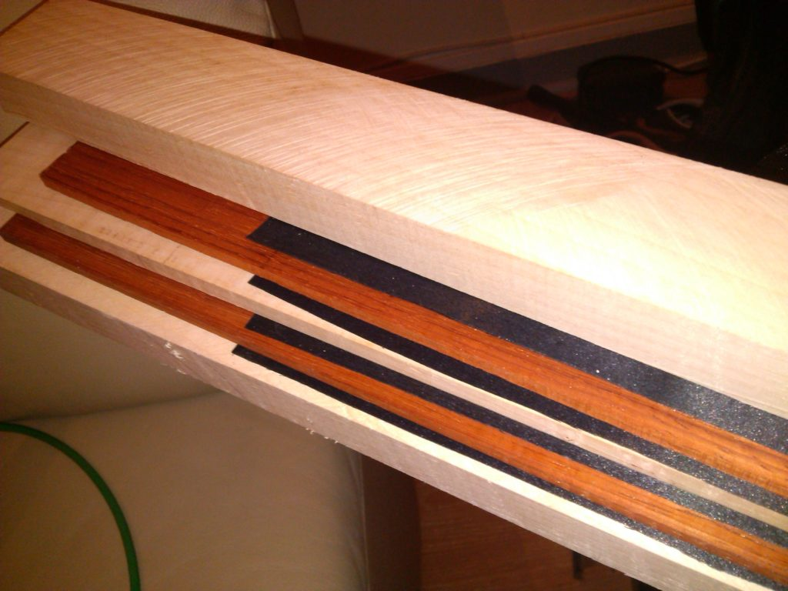

Arrangement des bois pour les plis du manche.

  

Bois pour le manche.

  

Détail des plis du manche, érable, filet noir et padouk.

  

Détail des plis du manche, érable, filet noir et padouk.

  

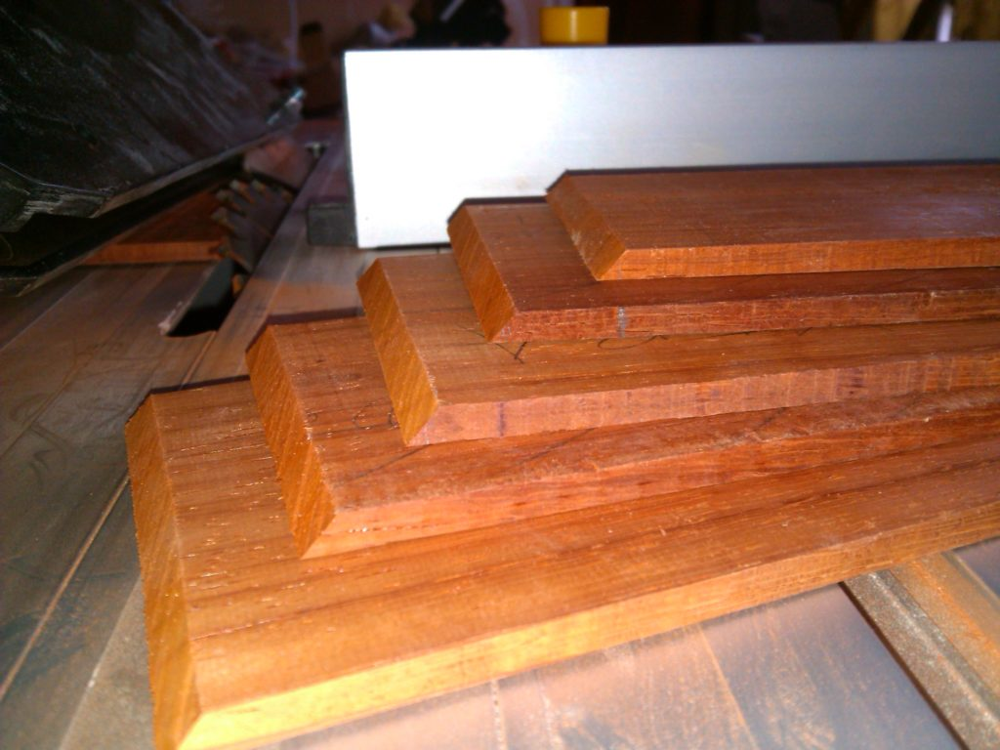

Planches de padouk pour les plis du manche, biseautés pour les joindre.

  

Collage de deux pièces d’un pli du manche.

  

Collage de deux pièces d’un pli du manche.

  

  

Plis du manche collés.

  

Plis du manche collés.

  

Manche sur le plan.

  

Découpe des contours du manche.

  

Découpe des contours du manche.

  

Découpe des contours du manche.

  

Découpe des contours du manche.

  

## Le corps

Bois bruts arrangés comme la future guitare.

  

Tracé du contour sur le patron du corps.

  

Tracé du contour sur le patron du corps.

  

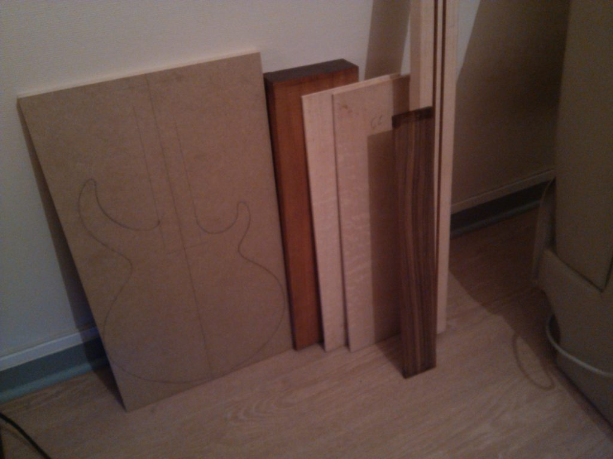

Les différents bois, ainsi qu’un panneau de medium pour faire le patron du corps.

  

Patron du corps découpé.

  

Patron du corps découpé.

  

Collage d’une aile du corps.

  

Collage des deux ailes du corps.

  

Corps collé au manche avec dessin du contour.

  

Découpage grossier du contour du corps.

  

Découpage grossier du contour du corps.

  

Contour du corps par rapport au patron.

  

Détourage du contour du corps avec le patron.

  

Détourage du contour du corps avec le patron.

  

Détourage du contour du corps avec le patron.

  

Première passe du détourage du contour.

  

Détourage du contour presque terminé.

  

Détourage du contour terminé.

  

Détourage du contour terminé.

  

Découpage « en marches » de la courbure de la table.

  

Découpage « en marches » de la courbure de la table.

  

Finition de la courbure de la table au tout pitit rabot.

  

Courbure de la table.

  

Le corps avec manche traversant vu de derrière.

  

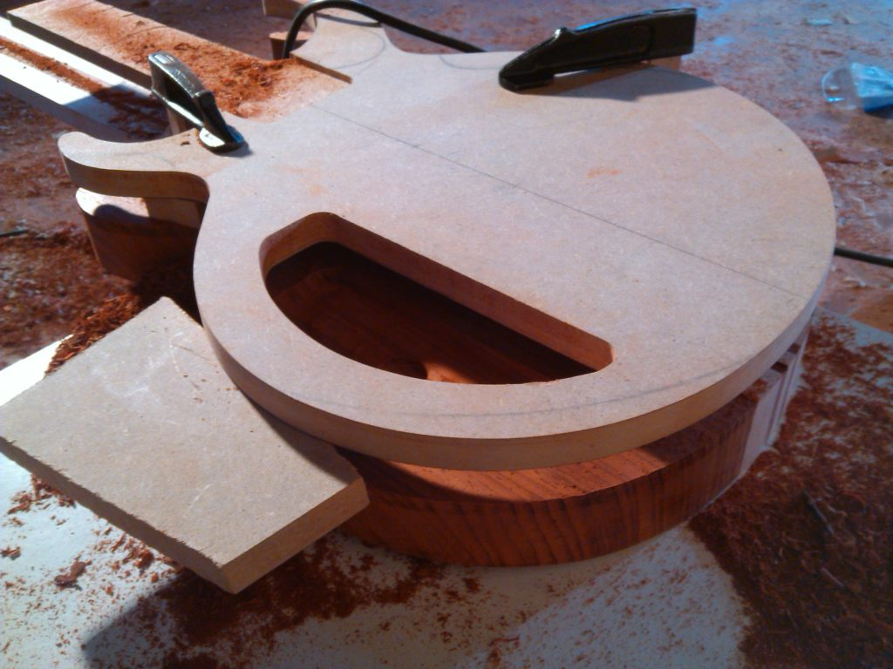

Chanfreinage de la cavité pour l’électronique.

  

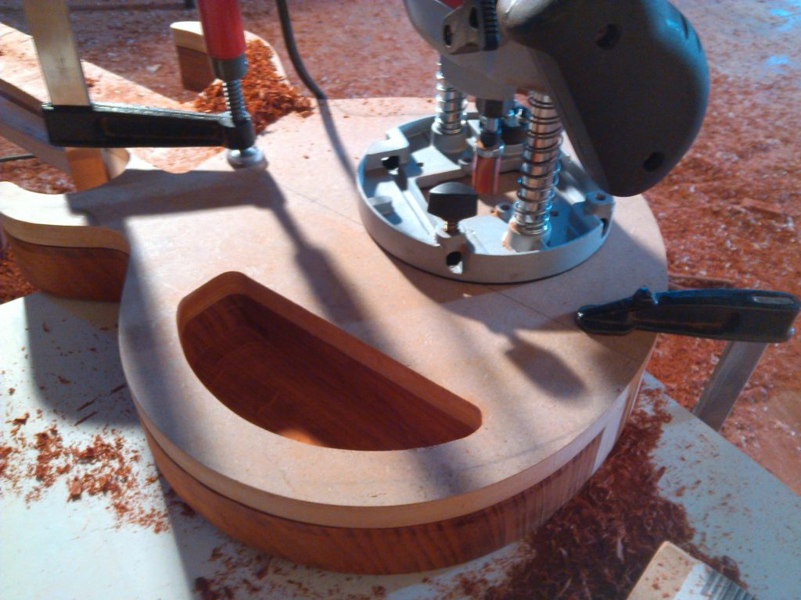

Chanfreinage de la cavité pour l’électronique.

  

Chanfreinage de la cavité pour l’électronique.

  

Cavité pour l’électronique.

  

Chanfreins pour les passages de câbles.

  

Chanfreins pour les passages de câbles.

  

Collage des deux ailes de la table.

  

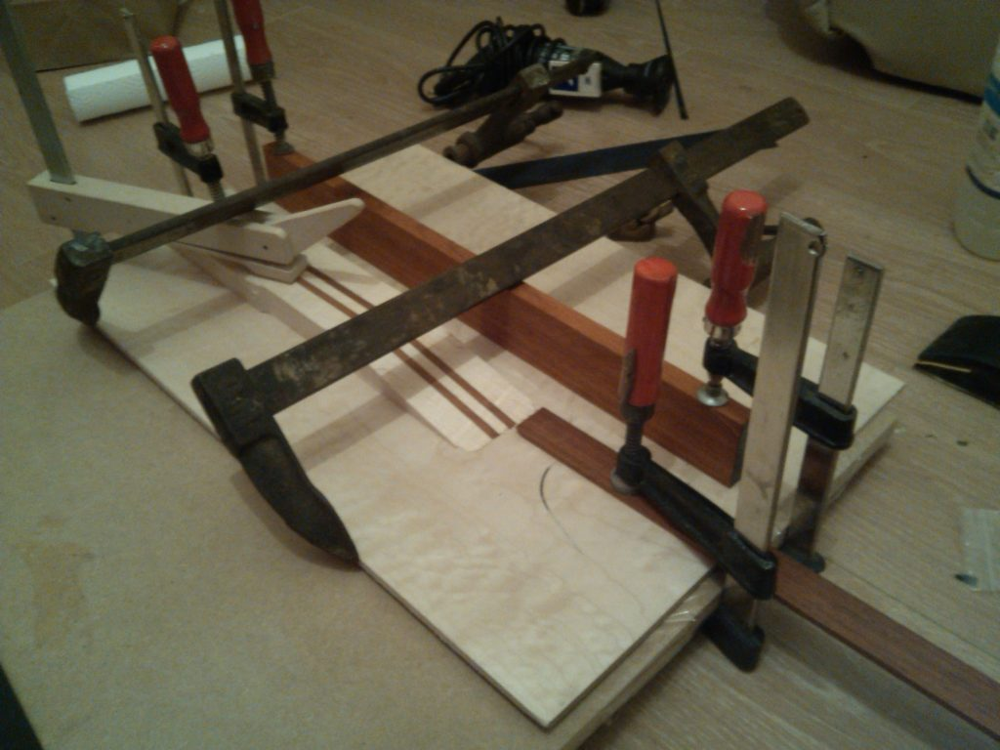

Collage des deux ailes de la table.

  

Collage de la table au corps.

  

Ailes de la table assemblées.

  

Table collée sur le corps et découpée grossièrement.

  

Arrière du corps avec la cavité pour l’électronique.

  

Contour de la table découpé avec touche et potentiomètres en place.

  

Contour de la table découpé.

  

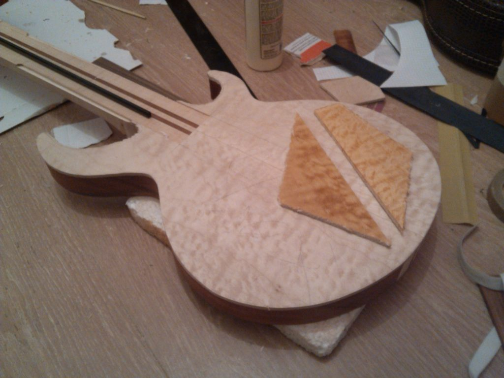

Tests de teintes pour la table.

  

Tests de teintes pour la table.

  

Mise à hauteur de la table.

  

Routage de la cavité du chevalet.

  

Chevalet en place.

  

Cavité du chevalet.

  

Cavité du chevalet vue de l’arrière.

  

Cavité du chevalet vue de l’arrière.

  

Micro manche en place dans sa cavité.

  

Cavités micros et chevalet.

  

Micros et chevalets en place dans les cavités.

  

Micros et chevalets en place dans les cavités.

  

Micros et chevalets en place dans les cavités.

  

Chanfreins arrondis sur le contour arrière.

  

Chanfrein pour le ventre.

  

Collage des filets.

  

Collage des filets.

  

Découpage de l’emplacement du cache pour la cavité électronique.

  

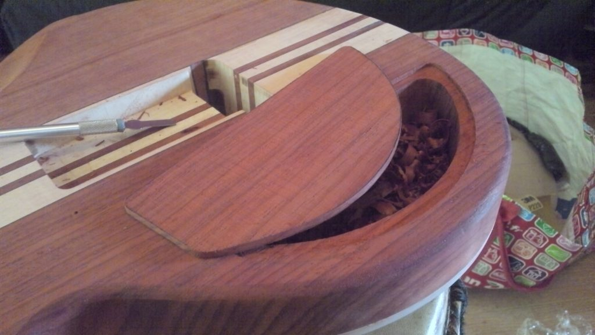

Cavité électronique et cache.

  

Découpe de l’emplacement du cache pour la cavité du chevalet.

  

Collage des pièces du cache pour la cavité du chevalet.

  

Cavité pour la prise jack.

  

Passage de câble vers la prise jack.

  

Caches arrières en position sur le corps.

  

Caches arrières en position sur le corps.

  

## Le profil du manche

Collage de la tête sur le manche.

  

Collage de la tête sur le manche.

  

Tête collée sur le manche.

  

Arrière de la jonction manche-tête.

  

Découpage des côtés du manche.

  

Collage des ailes de la tête.

  

Mise en forme du manche.

  

Mise en forme du manche.

  

Mise en forme du manche.

  

Mise en forme de la jointure du manche avec le corps.

  

## La tête

Début de découpe de l’incrustation en nacre.

  

Début de découpe de l’incrustation en nacre.

  

Début de découpe de l’incrustation en nacre.

  

Découpage du patron de la tête.

  

Découpage du patron de la tête.

  

Collage des ailes du placage de tête.

  

Contours de la tête sur le bois.

  

Cache pour la tige de réglage.

  

Bouchage des pores et des trous autour de l’incrustation de la tête.

  

Première couche d’huile sur la tête.

  

Perçage des trous pour les mécaniques.

  

Mécaniques en place sur la tête.

  

## La touche

Collage des repères de touche.

  

Préparation pour le frettage.

  

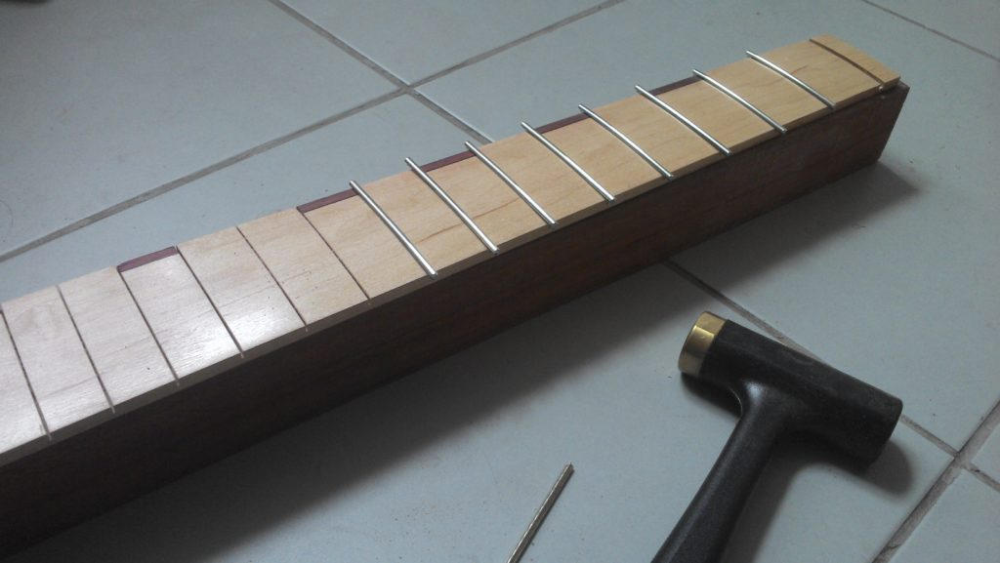

Frettage.

  

## La teinte

Couche de teinte noire sur la table pour faire ressortir le grain.

  

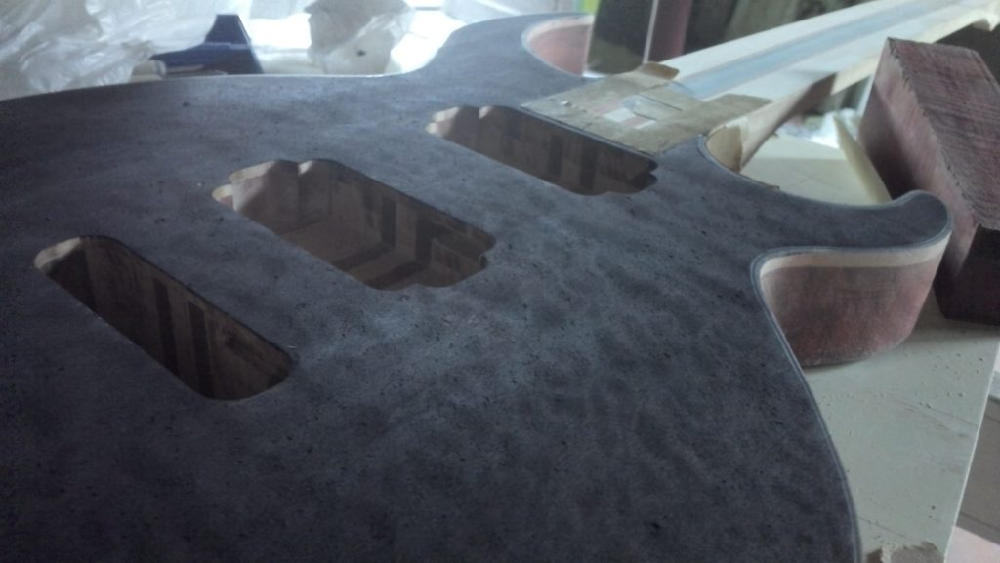

Couche de teinte noire sur la table pour faire ressortir le grain.

  

Couche de teinte noire sur la main pour faire ressortir le grain.

  

Ponçage de la couche de teinte noire pour ne garder que l’effet de profondeur.

  

Couches de teintes jaune et ambre.

  

Perçage des trous pour les potentiomètres.

  

Table après plusieurs couches d’huile.

  

## La guitare

Caches arrières en position sur le corps.

  

Avant de la guitare.

  

Corps.

  

Tête, avec incrustation et cache pour la tige de réglage.

  

Tête, avec incrustation et cache pour la tige de réglage.

  

Dos avec caches en place.

  

Détail du dos.

  

Détail du dos et de la jonction du manche.

  

Détail des caches du dos.

  

Détail de la tête et du talon à la jonction du manche.

  

Détail de la tête et du talon à la jonction du manche.

  

Ensemble vu de la tête.

  

Détails des micros et du chevalet.

  

Ensemble vu de dessus.

  

Ensemble vu de dos.

  

Détail du chanfrein du dos.

  

## Le son

<iframe width="100%" height="300" scrolling="no" frameborder="no" src="https://w.soundcloud.com/player/?url=https%3A//api.soundcloud.com/playlists/356067067&amp;color=%230088cc&amp;auto_play=false&amp;hide_related=false&amp;show_comments=true&amp;show_user=true&amp;show_reposts=false&amp;show_teaser=true&amp;visual=true"></iframe>