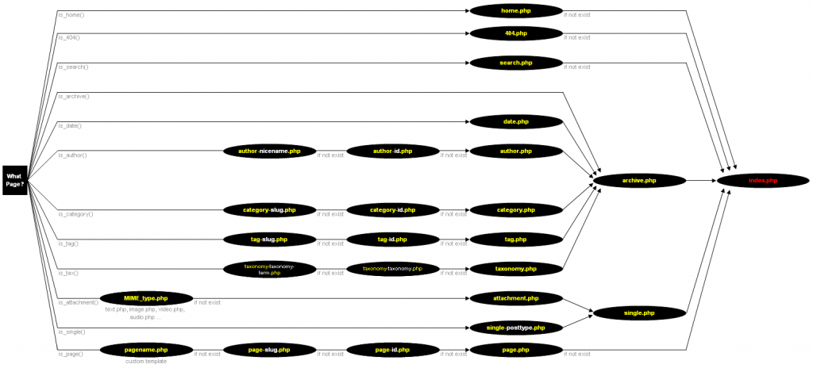

C'est parti pour les choses sérieuses ! Nous allons aborder la création de thème de manière générale d'abord... Pour la suite de ce tutoriel, je vais considérer que nous avons un dossier nommé _wordpress_ où est installé WordPress (ingénieux non ?). Ce dossier contient donc les traditionnels dossiers _wp-admin_, _wp-content_ et _wp-includes._ Comme vous le savez sûrement déjà, les thèmes sont placés sous _wordpress/wp-content/themes/_. Pour loger tous les fichiers de notre thème, nous allons créer un dossier dans _themes/. Par exemple, _wordpress/wp-content/themes/montheme_._

## Schéma général

Voici les fichiers que WordPress va chercher pour mettre en page différentes situations (cliquez sur l'image pour y voir quelque chose) :  Par exemple, pour afficher la page d'accueil, WordPress va d'abord chercher le fichier _home.php_. Si ce fichier n'existe pas, il utilisera _index.php_. Pour afficher un article, il utilisera dans l'ordre _single-\[type\].php_ (où \[type\] est un type d'article), ou _single.php_, ou _index.php_. Pour des informations plus précises, je vous conseille [cet article de la documentation officielle](http://codex.wordpress.org/fr:Hi%C3%A9rarchie_de_modeles), ainsi que [cette très bonne infographie](http://yoast.com/wordpress-theme-anatomy/) proposée par [Erwan](http://www.zapwallpaper.fr/blog/) ;). Wordpress cherchera toujours du fichier le plus spécifique au plus général : index.php. Du coup, et heureusement, vous n'êtes pas obligés de fournir tous ces fichiers pour avoir un thème fonctionnel ;).

## Le strict minimum

Voici la liste minimale des fichiers dont vous aurez besoin pour faire tourner votre blog :

*   _index.php_ : le fichier sur lequel WordPress tombe si il n'a rien trouvé de plus spécifique.
*   _style.css_ : comme son nom l'indique, le style du thème.

C'est tout 🙂 ! Bien évidemment, avec un seul fichier Php, vous risquez vite de vous retrouver avec un énooooorme fichier, plein de conditions et autres alourdissements de code. Typiquement, un thème simple inclus également ces fichiers :

*   _header.php_ : l'en-tête de page. Contient généralement le titre et la description du blog, et un menu principal.
*   _footer.php_ : le pied de page. Contient généralement les mentions légales du blog, parfois des liens partenaires etc.
*   _comments.php_ : gère l'affichage des commentaires sur un article.
*   _sidebar.php_ : la barre latérale, celle que vous voyez à droite de ce blog, qui contient les widgets : liste des catégories, recherche, liens...

Ces différents fichiers sont ensuite inclus aux endroits appropriés dans _index.php_. De cette manière, vous découpez votre thème en différentes parties aux fonctions bien précises. Résultat : un code moins long dans chaque fichier, plus clair.

## Le nécessaire pour notre thème

Dans la suite de ce tutoriel, nous allons rajouter quelques fichiers pour gérer tous les cas possibles plus finement. Les voici :

*   _single.php_ : utilisé pour afficher un article en particulier.
*   _page.php_ : même chose pour une page.
*   _searchform.php_ : le formulaire de recherche du blog.
*   _functions.php_ : un fichier qui rassemble différentes fonctions de configuration du thème.

Pour partir sur cette base, je vous propose donc de créer ces différents fichiers dans votre dossier _montheme/_. Ensuite, [passez à l'étape suivante](/archives/creer-un-theme-wordpress-4-informations-sur-le-theme) !

### Sommaire du tutoriel

1.  [Introduction](/archives/creer-un-theme-wordpress-1-introduction)
2.  [Installation](/archives/creer-un-theme-wordpress-2-installation)
3.  L'architecture des fichiers (on y est !)
4.  [Informations sur le thème](/archives/creer-un-theme-wordpress-4-informations-sur-le-theme)
5.  [La mise en page générale](/archives/creer-un-theme-wordpress-5-la-mise-en-page-generale)
6.  [L'en-tête de page](/archives/creer-un-theme-wordpress-6-len-tete-de-page)
7.  [Les articles](/archives/creer-un-theme-wordpress-7-les-articles)
8.  [Articles et pages seuls](/archives/creer-un-theme-wordpress-8-articles-et-pages-seuls)
9.  [Les commentaires](/archives/creer-un-theme-wordpress-9-les-commentaires)
10.  [La barre latérale](/archives/creer-un-theme-wordpress-10-la-barre-laterale)
11.  [Le pied de page](/archives/creer-un-theme-wordpress-11-le-pied-de-page)