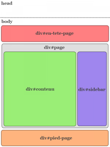

Maintenant que nous avons installé WordPress et configuré notre thème, nous allons pouvoir commencer à coder 😉 !

Je vais d'abord vous présenter la structure que j'ai choisie pour la suite du tuto. C'est une structure très simple mais complète, que vous retrouverez souvent sur les blogs. Donc rien de bien original pour l'instant, mais il faut bien commencer par quelque chose !

Voici donc cette structure suivie d'un petit schéma :

*   _En-tête_ : Titre et description du blog, menu
*   _Contenu_ : les différents articles ou pages
*   _Barre latérale_ : fonction de recherche, liste de catégories, liens...
*   _Pied de page_ : mentions légales

_Cliquez sur l'image pour l'agrandir_



Voici le code que nous allons obtenir :

```html
<!DOCTYPE html>

<html>
     <head>

     </head>

     <body>
          <div id="en-tete-page">
               <div id="menu">

               </div>
          </div>

          <div id="page">
               <div id="contenu">

               </div>

               <div id="sidebar">

               </div>
          </div>

          <div id="pied-page">

          </div>
     </body>
</html>
```

J'ai utilisé ici un doctype Html5, mais rien ne vous empêche de le changer ;).

## Découpage

Le découpage est une technique répandue en développement web qui consiste à découper une page en plusieurs fichiers réutilisables. De cette manière, il suffit d'inclure les différents fichiers suivant la situation pour construire une page adaptée.

Vous vous souvenez des différents fichiers que nous avions créé dans _montheme/_ ? En fait, il correspondent exactement à notre structure. C'est tout de même bien fait 😛 !

Eh oui... Toute la partie haute va filer dans _header.php_, le contenu dans _index.php_, la sidebar dans _sidebar.php_, et la partie basse dans _footer.php_. Une fois le code découpé, voici ce que vous devriez obtenir :

_header.php :_

```html
<!DOCTYPE html>

<html>
     <head>

     </head>

     <body>
          <div id="en-tete-page">
               <div id="menu">

               </div>
          </div>

          <div id="page">
```

_index.php :_

```html
<div id="contenu">

</div>
```

_sidebar.php :_

```html
<div id="sidebar">

</div>
```

_footer.php :_

```html
</div> <!-- fermeture de #page --> 

          <div id="pied-page">

          </div>
     </body>
</html>
```

Reste un petit ajout à faire pour pouvoir tester notre thème. Si vous vous rappelez bien, lorsque WordPress ne trouve pas de fichier spécifique pour afficher quelque chose, il utilise _index.php_. Seulement, les autres fichiers que nous avons remplis n'entrent pas en ligne de compte; il va falloir les inclure nous même depuis _index.php_.

Heureusement, WordPress a tout prévu et nous propose une fonction Php d'inclusion par fichier. Les voici :

*   get\_header( )
*   get\_sidebar( )
*   get\_footer( )

Je pense que le nom des fonctions parle de lui-même ;). Concrètement, _get\_header( )_ inclura l'ensemble du fichier _header.php_ au niveau de l'appel de la fonction, _get\_sidebar( )_ l'ensemble de _footer.php_ etc.

Voici à quoi va ressembler notre fichier _index.php_ avec l'appel de ces fonctions :

```html
<?php get_header( ); ?>

<div id="contenu">

</div>

<?php get_sidebar( ); ?>
<?php get_footer( ); ?>
```

Grâce à ce procédé, pas besoin d'écrire 40 fois le code de l'en-tête et autres, il suffit de l'inclure ;).

Maintenant que nous avons structuré ces différents fichiers, [nous allons pouvoir les remplir pour enfin afficher quelque chose](/archives/creer-un-theme-wordpress-6-len-tete-de-page) 🙂 !

### Sommaire du tutoriel

1.  [Introduction](/archives/creer-un-theme-wordpress-1-introduction)
2.  [Installation](/archives/creer-un-theme-wordpress-2-installation)
3.  [L'architecture des fichiers](/archives/creer-un-theme-wordpress-3-larchitecture-des-fichiers)
4.  [Informations sur le thème](/archives/creer-un-theme-wordpress-4-informations-sur-le-theme)
5.  La mise en page générale (on y est !)
6.  [L'en-tête de page](/archives/creer-un-theme-wordpress-6-len-tete-de-page)
7.  [Les articles](/archives/creer-un-theme-wordpress-7-les-articles)
8.  [Articles et pages seuls](/archives/creer-un-theme-wordpress-8-articles-et-pages-seuls)
9.  [Les commentaires](/archives/creer-un-theme-wordpress-9-les-commentaires)
10.  [La barre latérale](/archives/creer-un-theme-wordpress-10-la-barre-laterale)
11.  [Le pied de page](/archives/creer-un-theme-wordpress-11-le-pied-de-page)