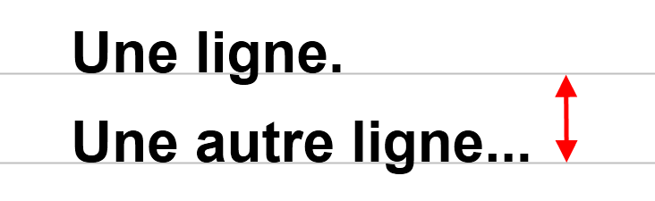
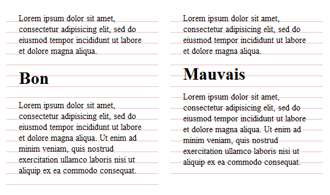

Ici, je vais vous parler d'un élément **capital** du design web : la typographie.

Trop souvent délaissée par les designers, la typographie est pourtant la première chose de laquelle se soucier. On le sait, sur internet, c'est le contenu qui prime. Le texte. Partant de ce constat, on comprend vite que la typographie doit être traitée avec soin, étudiée en finesse. Un texte agréable à lire donnera envie au lecteur de le suivre et évitera tant que possible la fatigue visuelle due à la lecture sur écran.

De plus, elle peut être un sujet d'étude extrêmement vaste d'un point de vue stylistique. Je fais partie des personnes qui pensent qu'une belle typographie vaut milles images et éléments de décor superflus.

Sommaire :

*   Un peu de culture...
    *   [Qu'est-ce que la typographie ?](#quoi)
    *   [Serif vs Sans-serif](#serif)
    *   [La chasse](#chasse)
*   Et du concret !
    *   [Les familles de polices](#familles)
    *   [La taille](#taille)
    *   [L’interlignage](#interlignage)
    *   [Le rythme vertical](#rythme)
    *   [L'échelle](#echelle)
    *   [Le contraste](#contraste)
    *   [La justification](#justification)
    *   [Les drapeaux](#drapeaux)

### Qu'est-ce que la typographie ?

> La typographie est d’abord l’art d’assembler des caractères mobiles afin de créer des mots et des phrases.

> La typographie est l’art et la manière de se servir des caractères : choix de la police, du corps, de la mise en page, etc. Si la typographie a presque disparu en tant que technique d’impression, elle se perpétue donc avec l’impression offset et les autres techniques, ainsi qu’avec le numérique.

Les bases sont posées : la typographie est donc un art à part entière. Vous allez comprendre pourquoi !

### Serif vs Sans-serif

Toute personne qui s'est un jour servi d'un traitement de texte a déjà rencontré ces termes barbares, associées à des polices (ou fontes).

Mais que signifient-ils réellement ? En fait, ils informent sur le type de terminaisons des caractères, leur empattement (serif en anglais). Voici un exemple en image :


À gauche, avec la police Arial, on voit que les traits qui forment les caractères sont droits aux extrémités. En revanche, avec la police à empattements Palatino, on distingue des petites pattes qui viennent adoucir la fin des traits (en rouge sur l'image). C'est ce qui distingue les polices serif et sans-serif.

### Que choisir pour mon design ?

Le web n'étant pas régi par les mêmes contraintes que dans l'imprimerie, on y utilise pas les mêmes règles.

Historiquement, on a considéré que seules les polices sans empattements étaient viables pour la lecture sur écran. En effet, sur un vieil écran ou avec une mauvaise résolution par exemple, lire une police à empattements est une véritable torture : les pattes sont pixelisées, mal définies, et on ne peut voir qu'un tas de caractères informes.

À l'heure actuelle ce problème est presque réglé, simplement parce que de telles configurations n'existent plus. On peut donc utiliser des polices à empattement en toute confiance, en veillant bien sûr à ce qu'elles soient lisibles (nous verrons comment plus tard).

Finalement, c'est à vous de décider quel style de police utiliser sur votre design, serif, sans-serif, ou un mélange des deux...

### La chasse

La chasse d'une police désigne la largeur de ses caractères. La majorité des textes que l'on peut lire sont écrits avec des polices à chasse variable, c'est à dire que la taille des différents caractères varie en fonction du caractère lui même. Par exemple, la lettre "m" est plus large que la lettre "i".

Mais il existe également des polices à chasse fixe, plus utilisées par les développeurs, dans lesquelles chaque caractère est de largeur égale. Elles permettent d'aligner les lettres horizontalement, ce qui facilite la lecture d'un code.


En général, on utilisera donc ce type de police pour afficher du code, ou des textes suivant certaines conventions.

### Les familles de polices

Comme vous le savez sûrement, le choix d'une police sur le web est déterminant. L'utilisateur, suivant son système d'exploitation, ne dispose pas des mêmes polices. C'est pourquoi Css propose un mécanisme de fallback, qui permet de définir une suite de fontes de la plus spécifique à la plus générique. Pour un rendu optimal de vos textes, il est très important de bien choisir cette liste. Voici une des plus simple que nous pourrions écrire :

```css
p {
     font-family: arial, sans-serif;
}
```

Ici, on souhaite utiliser en priorité la police Arial, une police sans empattement très répandue. Si malgré tout elle n'existe pas, avec la mention _sans-serif_, on laisse le navigateur choisir une police sans empattement dans celles dont il dispose.

Cette liste est très minimaliste. En général, on proposera plusieurs choix de polices, les plus proches possibles, avant le choix générique.

Pour vous faciliter la tâche, certains développeurs ont pris soin de noter des collections de polices très utiles. En voici quelques unes (honteusement copiées depuis [cet article](http://www.alsacreations.com/article/lire/631-quelles-polices-pour-un-site-web.html) d'[alsacréations](http://www.alsacreations.com/)).

### Serif

```css
font-family: Times, "Times New Roman", "Liberation Serif", FreeSerif, serif; 
font-family: Georgia, "DejaVu Serif", Norasi, serif;
```

### Sans-serif

```css
font-family: Arial, Helvetica, "Liberation Sans", FreeSans, sans-serif; 
font-family: "Trebuchet MS", Arial, Helvetica, sans-serif; 
font-family: "Lucida Sans", "Lucida Grande", "Lucida Sans Unicode", "Luxi Sans", sans-serif; 
font-family: Tahoma, Geneva, Kalimati, sans-serif; 
font-family: Verdana, "DejaVu Sans", "Bitstream Vera Sans", Geneva, sans-serif; 
font-family: Impact, "Arial Black", sans-serif;
```

### Chasse fixe (monospace)

```css
font-family: Courier, "Courier New", FreeMono, "Liberation Mono", monospace; 
font-family: Monaco, "DejaVu Sans Mono", "Lucida Console", "Andale Mono", monospace;
```

Pour un aperçu de la disponibilité des différentes polices, je vous conseille cet article : [http://www.codestyle.org/css/font-family/index.shtml](http://www.codestyle.org/css/font-family/index.shtml). Il donne une bonne base pour savoir quelles polices sont plus sûres à utiliser, et quelles polices risquent de ne pas être disponibles. Ce rapport est assez rassurant en fait, on ne dispose pas d'un si petit choix qu'on veut bien nous le faire croire !

### La taille

La taille d'une fonte est très importante pour la lisibilité de votre texte. Il faut veiller à ce qu'elle ne soit ni trop petite, ni trop grande.

Sans Css, la plupart des navigateurs affichent le texte à la taille de 16 pixels. En général, cela paraît grand pour des habitués de la lecture sur écran, mais c'est en fait l'équivalent de la taille des polices utilisées dans l'imprimerie. Sur le web, on trouve le plus souvent des tailles de 12 à 14 pixels.

En règle générale, une taille acceptable se situe entre 12 et 16 pixels. On peut descendre à 10px pour des notes annexes, des informations complémentaires par exemple, et monter en taille pour les éléments clés : titres, menus, etc.

Pour être à l'aise, on définit généralement une taille de base pour tous les paragraphes, voire pour tout le design, comme ceci :

```css
body {
     font-size: 14px;
}
```

De cette manière, tous les textes seront affichés à la taille de 14px.

### Note sur les unités

Comme vous le savez sûrement, Css permet de définir la taille en valeur absolue (px) ou en valeur relative (em, %, ...). Pour cet article, j'utiliserai uniquement les tailles absolues, car elles sont plus simples à utiliser, donc plus explicites pour appuyer mes propos.

La grosse différence réside dans le fait que le dimensionnement relatif permet de redimensionner le texte dans le navigateur. C'est un bon point pour l'accessibilité !

### L'interlignage

Trop peu de web designers connaissent ou utilisent cette propriété. Pourtant, elle est un facteur extrêmement important pou la lisibilité.

Alors qu'est-ce donc ? L'interlignage est la distance qui sépare les lignes de base de deux lignes de texte.



On comprend vite que la hauteur de ligne va influer sur "l'aération" du texte. On parle dans ce cas de couleur typographique, dans le sens que dans sa globalité, un texte très serré paraîtra plus sombre qu'un texte aéré.

Pour qu'un paragraphe soit lisible, il faut absolument que le texte respire, que l'on distingue bien les lignes. C'est pour cette raison que l'on doit s'intéresser de près à l'interlignage.

Sur le web, on peut considérer qu'un bon interlignage est de 2 à 5 points plus grand que la taille de police. Pour notre police de 14px, nous choisirons par exemple 18px de hauteur de ligne. En Css, on la définira comme suit :

```css
body {
     font-size: 14px;
     line-height: 18px;     /* hauteur de ligne */
}
```

### Le rythme vertical

En étroite relation avec l'interlignage, le rythme vertical est important pour la fluidité de lecture. Cette fois, commençons avec un exemple :



J'ai représenté par des lignes un interlignage constant qui forme une grille de référence. Sur la partie gauche, on voit que le texte est toujours aligné sur cette grille, ce qui permet de conserver un rythme vertical. D'une part, cela améliore la lisibilité en facilitant le suivi du texte, et d'une autre part cela apporte une certaine cohérence à votre design qui paraît plus clair, plus ordonné. Sur la partie de droite, le rythme a été mal étudié et casse complètement le flux de texte.

Alors comment respecter cette fameuse grille de référence ? La réponse est simple : travailler avec la hauteur de ligne et ses multiples.

Concrètement, la hauteur de ligne de n'importe quel élément sera un multiple de la hauteur de base; l'élément en question occupera donc une ou plusieurs lignes de la grille. Il en sera de même pour les marges, qui se comporteront donc comme des sauts de ligne.


On voit clairement sur cette image que chaque élément occupe un nombre exact de lignes. Le rythme vertical est donc parfaitement conservé. Voici comment nous pourrions traduire ceci en Css :

```css
h1 {
     font-size: 28px;
     line-height: 36px;       /* le double de l'interlignage de base */
     margin-bottom: 18px;     /* l'interlignage de base */
}

p {
     /**
      *   p hérite des propriétés de body, pas besoin
      *   de redéfinir la taille et l'interlignage
      */
     margin-bottom: 18px;     /* l'interlignage de base */
}
```

Avec ce type de code, tout devrait s'aligner parfaitement ! Souvenez-vous que même si un bon rythme vertical ne se voit pas au premier coup d'oeil, il se ressent vraiment. Alors ne le laissez pas de côté !

### L'échelle

Pour maintenir une bonne cohérence dans votre design, il est utile d'utiliser une échelle de tailles pour vos titres, ce qui permet de les différencier facilement. Vous pouvez choisir une échelle standard, comme définir la votre. On pourrait par exemple imaginer une échelle basée sur la suite de Fibonacci ou le nombre d'or...

Voici un exemple simple d'échelle :

```css
h1 {
     font-size: 48px;
}

h2 {
     font-size: 36px;
}

h3 {
     font-size: 24px;
}

h4 {
     font-size: 21px;
}

h5 {
     font-size: 18px;
}

h6 {
     font-size: 16px;
}

p {
     font-size: 14px;
}
```

En gardant à l'esprit la notion de rythme vertical, on peut ajouter des hauteurs de lignes et des marges (toujours multiples de la hauteur de base)...

```css
h1 {
     font-size: 48px;
     line-height: 54px;       /* 3 fois l'interlignage de base */
     margin-bottom: 18px;     /* l'interlignage de base */
}

h2 {
     font-size: 36px;
     line-height: 36px;       /* 2 fois l'interlignage de base */
     margin-bottom: 18px;
}

/* ... */
```

Et voilà une belle échelle qui respecte notre grille !

### Le contraste

Je vous parlais tout à l'heure de couleur typographique. Ici, je vais aborder un thème qui s'en rapproche, le contraste texte/fond. Pour des raisons d'accessibilité, de lisibilité, il est important d'éviter les trop forts contrastes entre la couleur du texte et l'arrière-plan. Par exemple, un texte noir sur fond blanc marque l'oeil, et brouille légèrement la vue lors de la lecture. C'est encore plus dérangeant pour les personnes déficientes visuelles, comme les daltoniens.


Nous préférerons donc des contrastes un peu moins marqués. Sur ce blog, j'utilise un gris foncé (#444) pour le texte. Remarquez que j'aurai aussi pu foncer légèrement l'arrière-plan. Bien évidemment, cela vaut aussi pour les textes blancs sur fond noir.

Voici un exemple réel : [Carsonified](http://www.carsonified.com/). Sur ce site, l'arrière plan est de couleur #141300, et le texte #FFFDD8. L'atténuation est très légère, mais grâce à ce choix judicieux, la page est beaucoup plus agréable à parcourir, l'oeil n'est pas perturbé.

Attention également à ne pas choisir des couleurs trop proches, ou qui se confondent. On imagine bien qu'un texte gris clair sur fond blanc sera difficile à lire, mais il arrive qu'on rencontre ce type de cas... Non pas par réel choix du designer, mais parfois à cause d'une image de fond sous le texte par exemple.

### La justification

Encore un aspect de la composition typographique à ne pas négliger pour le confort de vos lecteurs. La justification, c'est la longueur d'une ligne de texte. Si vous la choisissez trop importante, le lecteur aura du mal à repérer la ligne suivante à chaque saut de ligne. Trop courte, et le lecteur passera plus de temps à sauter de ligne qu'à lire le texte !

Une ligne de 65 caractères est considérée comme un compromis idéal. Pour trouver notre justification, nous allons utiliser une méthode simple, celle de Robert Bringhurst, qui consiste à multiplier la taille de la fonte par 30. Dans notre cas, la largeur idéale de texte serait de 14 x 30 : 420 pixels. Bien sûr, vous pouvez varier de quelques dizaines de pixels, au feeling...

Suivant la façon dont votre design est conçu, il y a plusieurs manières de définir cette taille. Par exemple :

```css
p {
     max-width: 420px;
}
```

On pourrait aussi utiliser la propriété _width_, ou appliquer la largeur au bloc entourant les paragraphes... À vous de voir ce qui vous convient le mieux.

### Les drapeaux

On désigne par ce terme les côtés du texte qui ne sont pas justifiés. Par exemple, pour un texte aligné à gauche, le drapeau est la partie droite, qui varie selon les lignes. Pour une question d'esthétique et encore une fois de lisibilité, essayez tant que possible de faire des drapeaux les plus droits possibles. Exemple :


Malheureusement, vous n'aurez pas toujours la main sur les drapeaux, étant donné que cela n'est pas géré automatiquement. Néanmoins, essayez d'y penser pour des pages statiques par exemple.

## En conclusion

C'est tout pour le moment ! Mais il y a encore beaucoup à apprendre sur la typographie. Je compléterai peut-être cet article avec de nouvelles notions.

J'espère en tous cas que vous en avez appris plus, et que vous avez pu vous rendre compte de l'importance de la typographie dans un design.

Sur ce, à bientôt !