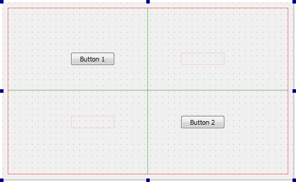
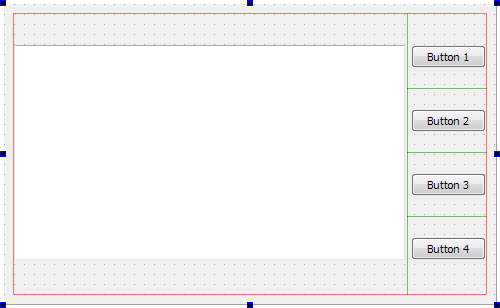
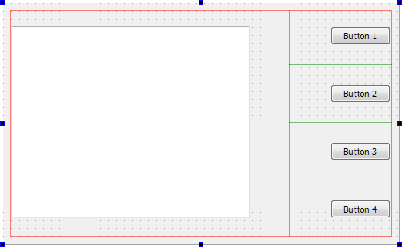
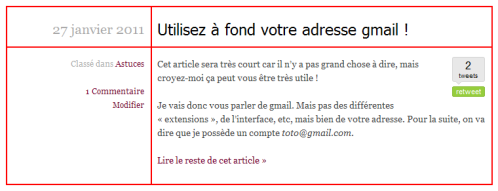

De plus en plus de sites web utilisent des grilles pour mettre en page leur contenus. C'est un système reconnu qui fournit une base solide de mise en page, tout en simplifiant le travail.

On trouve beaucoup de frameworks Css plus ou moins complets qui permettent l'utilisation de grilles, comme [978.gs](http://978.gs/) ou [Blueprint Css](http://www.blueprintcss.org/). Mais finalement, aucun vrai système de grille n'est intégré au Css par défaut.

Alors pourquoi ne pas imaginer un vrai système de grilles qui nous épargnerai tous ces _float_ et autres _clearfix_ ?

En tant que développeur C++, j'ai beaucoup travaillé avec [Qt](http://qt.nokia.com/products/), une excellente librairie qui couvre tous les aspects de développement d'un logiciel - GUI (qu'on peut customiser par Css !), réseau, tests unitaires, évènements, multithreading et autres noms barbares 🙂

Ce qui va nous intéresser pour cet article, c'est le système de layouts proposé pour mettre en place les interfaces, extrêmement simple et efficace.

On a le choix entre 4 layouts :

*   Vertical - les éléments sont empilés les uns sur les autres
*   Horizontal - les éléments sont placés côte à côte
*   Formulaire - présentation typique : labels à gauche et champs à droite
*   **Grille** - celui que nous allons voir plus en détail 😉

### Exemple avec Qt

Voici un exemple simple de layout en grille :



Tout fonctionne par coordonnées. Dans cette grille de 2 cases par 2, le bouton 1 est situé en (0,0), et le bouton 2 en (1,1). Pas plus compliqué qu'une bataille navale !

Bien sûr, de la même manière qu'avec les tableaux Html, on peut aller plus loin :



Ici, la zone de texte blanche va de la case (0,0) à (0,3), le bouton 1 est en (1,0), le bouton 2 en (1,1) etc...

Enfin, on peut aussi modifier l'espacement horizontal et vertical entre les éléments :



Ce sera tout pour l'exemple. Mais sachez que l'on peut faire des réglages très fins, par exemple définir la manière dont les éléments se comportent au sein du layout - prennent-ils tout l'espace disponible ? Le minimum ? Une taille fixe ? - et plus encore ;).

### Et en Css ?

Nous voilà arrivés à ce qui nous intéresse vraiment, adapter ce système au Css !

Pour l'exemple, j'utiliserai la page d'accueil de mon blog qui devrait assez bien se prêter à l'exercice.

Voici comment peut se découper un article :



Et voici un aperçu de la structure Html :

```html
<article>
     <header>
          <h2><!-- titre --></h2>
          <span class="date"><!-- date --></span>
     </header>

     <aside>
          <!-- meta infos - catégories, tags etc -->
     </aside>

     <div class="content">
          <!-- contenu de l'article -->
     </div>
</article>
```

Le but est donc de mettre la date en haut à gauche, le titre en haut à droite, et vous aurez deviné la suite...

Actuellement, j'utilise les flottants pour mettre tout cela en place. Heureusement, la structure n'est pas trop excentrique et donc assez simple à transcrire en Css.

Maintenant, imaginons quelques propriétés magiques !

```css
/**
 *   un article est divisé en 2 colonnes
 *   et 2 lignes
 */
article {
     grid: 2 2;
}

/**
 *   le titre est en haut à droite
 *   ( colonne 1, ligne 0 )
 */
article h2 {
     coordinates: 1 0;
}

article .date {
     coordinates: 0 0;
}

article aside {
     coordinates: 0 1;
}

article .content {
     coordinates: 1 1;
}
```

Et c'est tout !

Bon bien sûr, je simplifie un peu, je ne propose pas un standard mais l'idée est là ! Avouez tout de même qu'on y gagnerait en clarté, et qu'un tel système se révèle beaucoup plus flexible qu'une grille basée sur des flottants ;).

## Le mot de la fin

Là, je vais aller me faire un café...

Si un jour l'inspiration me vient pour écrire une fin convenable à cet article, promis je le ferais !