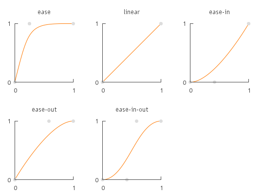

Bonjour vous 🙂 ! Je vais vous parler d'une des innovations fort sympathiques du Css3 : les transitions. J'utilise cette propriété sur les liens de mon blog par exemple (ceux qui changent de couleur doucement vers le rouge - si vous avez un navigateur compatible 😉 ). En fait, les transitions vous permettent de réaliser des effets très simplement sur toutes sortes de propriétés comme la largeur d'un élément, ses couleurs, etc, **sans utiliser Javascript**. Elles ont pour rôle "d'adoucir" un changement d'état lors d'une action comme un survol ou une prise de focus. L'avantage, c'est que les transitions peuvent être déclenchés via une pseudo-classe Css (:hover, :focus ou :active), ou par JavaScript pour étendre les possibilités. Les transitions se décomposent en plusieurs propriétés, qui sont les suivantes :

*   **transition-property** : _la propriété qui sera modifiée par la transition._
*   **transition-timing-function** : _la fonction de transition utilisée._
*   **transition-duration** : _la durée de la transition._
*   **transition-delay** : _le temps avant que la transition ne se déclenche._

**Remarque importante :** Comme toute nouvelle norme, le Css3 va prendre son temps avant d'être utilisable sur tous les navigateurs. En attendant, chacun fait sa sauce et propose ces propriétés dans une version spécifique. Pour cibler le plus possible de navigateurs, il vous faudra ajouter un préfixe spécifique par navigateur. Concrètement, ajouter _\-o-_ pour Opera, _\-moz-_ pour Firefox, et _\-webkit-_ pour les navigateurs basés sur le moteur de rendu Webkit, comme Chrome ou Safari. Vous allez donc devoir déclarer 4 fois une même règle pour que tout ce petit monde la comprenne. Voici à quoi ressemble la déclaration de transition sur les liens de ce blog (seulement pour la propriété _transition-property_ 😛 ) : _Code Css3 :_

```css
a {
     transition-property: color;
     -o-transition-property: color;
     -moz-transition-property: color;
     -webkit-transition-property: color;
}
```

Oui, je sais, c'est décourageant ! Mais finalement, une fois les règles de base écrites, un _ctrl+c_/_ctrl+v_ va grandement vous simplifier le travail 😉 . A noter que par la suite, je n'utiliserai pas les préfixes pour des raisons (évidentes) de lisibilité.

## transition-property

Voici tout d'abord la liste des propriétés sur lesquelles on peut jouer : [c'est ici](http://www.w3.org/TR/css3-transitions/#properties-from-css-). Vous voyez qu'il y a tout de même de quoi faire ! Grossièrement, on va modifier soit les couleurs d'un élément, soit le box-model (taille, padding, bordure, marges, etc), soit les deux bien entendu. La syntaxe est simple. Imaginons qu'on veuille changer la couleur d'un élément à son survol. On déclare d'abord la couleur de l'élément à l'état normal, puis la nouvelle couleur au survol. Jusqu'ici rien d'extraordinaire. Ensuite, il suffit d'ajouter la propriété _transition-property_, en l'appliquant à la propriété _color_ (choisie dans la liste des propriétés possibles au-dessus). De cette manière, une transition sera effectuée au survol de l'élément et la couleur changera doucement. Un petit exemple ne sera pas de trop ;). _Code Css :_

```css
/* etat normal */
div.test {
     color: #000;
     transition-property: color; /* on applique une transition sur la couleur */
}

/* etat survolé */
div.test:hover {
     color: #fff;
}
```

La propriété _transition-property_ peut prendre pour valeurs :

*   **all** : _valeur par défaut, toutes les propriétés de_ [_cette liste_](http://www.w3.org/TR/css3-transitions/#properties-from-css-)_._
*   **propriété** : _une ou plusieurs des propriétés de la liste au-dessus._
*   **none** : _aucune animation._

## transition-timing-function

C'est probablement la plus importante des propriétés définissant une transition. Elle détermine quelle allure va avoir cette transition, comment elle va évoluer dans le temps. Cette propriété peut prendre pour valeurs :

*   **ease** : _rapide sur le début et ralenti sur la fin._
*   **linear** : _vitesse constante sur toute la durée de l'animation._
*   **ease-in** : _lent au début et accélère vers la fin._
*   **ease-out** : _rapide au début et ralentit vers la fin._
*   **ease-in-out** : _départ et fin lents, donne une animation douce._

_Ci-dessous, la représentation mathématique de ces différentes fonctions :_  Je vous conseille de faire un tour sur cette [page d'exemple](http://www.alsacreations.com/xmedia/tuto/exemples/transitions/timing.htm) du site Alsacréations, qui montre ces types de transition en live 😉 (si vous avez un navigateur compatible...). Bon... Maintenant, passons aux réglages fins !

## transition-duration & transition-delay

Comme leurs noms l'indiquent, ces deux propriétés gèrent ce qui touche au temps dans une transition. Plus exactement, _transition-duration_ gère la durée de la transition (en combien de temps l'élément concerné va passer d'un état à un autre), et _transition-delay_ gère la durée avant le déclenchement de la transition (par exemple, un lien change de couleur quand l'internaute le survole depuis une seconde). Les valeurs données à ces propriétés s'expriment en secondes (s) ou millisecondes (ms). Maintenant, avec tout ce que nous venons de voir, voici un petit exemple qui mélange tout ! On va faire un paragraphe qui change de couleur en 1 seconde, au bout d'une demi-seconde de survol, et qui utilise une fonction _ease-in-out_. _Code Html :_

```html
<p>Bonjour ! je suis le paragraphe de test, survolez-moi !</p>
```

_Code Css3 :_

```css
p {
     width: 50px;
     color: #f00;
     transition-property: color;
     transition-timing-function: ease-in-out;
     transition-delay: 500ms;
     transition-duration: 1s;
}
p:hover {
     width: 100px;
     color: #0f0;
}
```

Et voici un exemple en live 😉 :

Bonjour ! je suis le paragraphe de test, survolez-moi !

**Note** Très franchement, j'ai du mal à trouver des applications à _transition-delay_... C'est le genre de choses que l'on peut trouver gênantes ou surprenantes à la visite d'un site. En effet, si une action se déclenche 1 seconde après une action, au mieux on trouve ça drôle, au pire on ne comprends pas d'où ça vient. Personnellement, j'aime que les choses réagissent directement, surtout que cela peut confirmer une intention de l'internaute (par exemple surligner un lien au survol l'invite à cliquer). J'imagine que _transition-delay_ a des applications plus spécifiques, par exemple dans le cadre d'une petite animation... Mais libre à vous de l'utiliser 🙂 !

## Notation raccourcie

Comme beaucoup de propriétés Css, les transitions possèdent une notation raccourcie, comme background, border et autres. Voici sa syntaxe : _Code Css3 :_

```css
div {
     transition:
          <transition-property>
          <transition-duration>
          <transition-timing-function>
          <transition-delay>
     ;
}
```

Avec cette notation, on peut écrire l'exemple précédent comme ceci : _Code Css3 :_

```css
<pre>p {
     width: 50px;
     color: #f00;
     transition: color 1s ease-in-out 500ms;
}
p:hover {
     width: 100px;
     color: #0f0;
}</pre>
```

Si on écrivait ce code pour qu'il soit compatible avec tous les navigateurs (vous savez, avec les préfixes _\-o-_, _\-moz-_ et _\-webkit-_ dont je vous parlais au début de l'article ?), il faudrait 16 lignes, contre 4 avec la notation raccourcie. Intéressant 😉 !

## Interaction avec Javascript

A venir...!