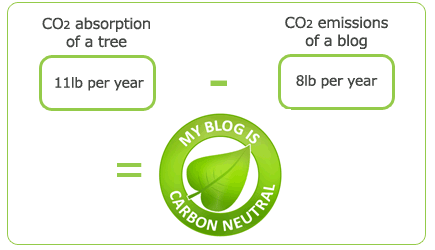

Comme tout ce qui existe d'artificiel, internet consomme de l'énergie. A chaque fois que votre blog est visité, il pollue (énergie consommée par le serveur, l'internaute, ...). Heureusement, pour les plus écolos d'entre nous, il existe beaucoup de moyens pour réduire cette pollution par le web.

Pour les autres, sachez que ces moyens sont sensiblement les mêmes que ceux mis en place pour optimiser une page, la rendre plus rapide et efficace, alors ne vous arrêtez pas en si bon chemin 😉 !

## Les requêtes

Sur internet, tout se demande. Quand vous visitez un site, vous demandez d'abord une page de base. Une fois reçue, vous demandez les images qu'elle contient, puis les feuilles de style, les scripts etc. Au final, tout ceci fait un paquet de requêtes, de trafic et donc de consommation d'énergie, pour rien.

Pour réduire tous ces échanges, le but est de réduire la taille et le nombre de tous les "fichiers joints" à votre page. En plus, cela ne peut qu'améliorer les performances de votre site car il sera nettement plus léger, donc rapide. Double avantage donc : un site plus rapide, et qui consomme moins.

### Réduire la taille

Il s'agit ici de "minifier", de compresser vos scripts externes (Css, Js, ...). Pourquoi ? Car quand vous écrivez un fichier Css par exemple, il faut qu'il soit lisible. Il contient donc une tonne de caractères inutiles pour le traitement par un navigateur comme des espaces, sauts de lignes etc. En bref, vous préférez voir ceci :

```css
div#test {
     width: 12px;
     height: 12px;
}
```

alors que votre fichier sera plus rapide à transférer et à traiter sous cette forme :

```css
div#test{width:12px;height:12px;}
```

Heureusement, vous n'avez pas à faire ce travail vous même, il existe des outils en ligne comme [minifycss.com](http://www.minifycss.com/css-compressor/), qui s'en chargeront pour vous. Celui-ci vous indique le taux de compression du fichier en sortie, c'est parfois assez impressionnant.

### Réduire le nombre

Vous l'aurez deviné, il est bien plus efficace de récupérer un fichier de 10ko que 10 fichiers de 1ko. Ceci est dû au fait que pour un gros fichier, vous ne faîtes qu'une demande, contre 10 pour des petits fichiers.

Il n'est pas rare de voir des sites avec plusieurs fichiers Css, et encore plus courant plusieurs fichiers JavaScript. Ce nombre augmente généralement avec l'utilisation de plugins externes (un slider d'images par exemple). Malheureusement, tous ces fichiers réduisent considérablement les performances d'un site, même si ils sont compressés.

Imaginons que nous ayons deux fichiers Css : un _reset.css_ (souvent utilisé pour annuler les différences d'affichage des différents navigateurs), et un _style.css_, le design du site. Au chargement de la page, on aura donc deux fichiers à demander, puis à récupérer. L'astuce ici, c'est de créer un nouveau fichier css, et de tout mettre dedans, le _reset_, et le _style_. Ainsi, on n'a plus qu'un fichier à charger et on gagne beaucoup de temps au niveau du client, tout en réduisant la charge du serveur. Une petite compression par là-dessus, et vous aurez à peine le temps de cliquer sur un lien que la page sera déjà chargée !

## Les couleurs

Vous ne le savez peut-être pas, mais certaines couleurs sur le web consomment moins d'énergie que d'autre à l'affichage. Pour l'anecdote, il a été calculé que le moteur de recherche de Google pourrait économiser 750 Megawatt-heure par an, si sa couleur dominante virait au noir ! D'ailleurs, le site [blackle.com](http://www.blackle.com/) à été lancé après cette constatation. Il consiste simplement à changer l'affichage des résultats de Google pour économiser l'énergie.

Tout ça pour dire que les couleurs sombres sont à priori moins gourmandes que les claires. Autant vous dire que je n'ai pas à me vanter de ce blog !

Pour information, Mark Ontkush a créé une palette de couleurs basse consommation assez jolie que voici :


Vous trouverez les codes hexadécimaux des couleurs sur l'[article original](http://ecoiron.blogspot.com/2007/01/emergy-c-low-wattage-palette.html). Malheureusement, [son site](http://ecoiron.blogspot.com/) n'est peut-être pas le plus bel exemple de l'utilisation de ces couleurs :P...

## Compensez, plantez un arbre !

Si vous n'êtes pas encore satisfait et que vous n'avez pas la main verte, vous pouvez faire planter un arbre pour compenser les émissions de carbones dues à votre blog. C'est ce que propose gratuitement [kaufda.de](http://www.kaufda.de/umwelt/carbon-neutral/how-you-can-join/), en échange d'un petit article sur leur initiative. Vous aurez ensuite le droit d'afficher fièrement un logo "My blog is carbon neutral".

_04/10/2010 : Ça y'est, je l'ai ! regardez tout en bas du blog ;)._



Selon eux, un arbre engloutirai plus de Co2 qu'un blog fréquenté par 15 000 visiteurs par mois !