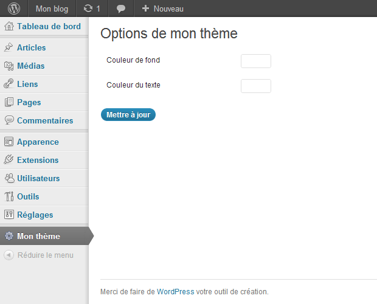

Si vous souhaitez offrir plus de choix de personnalisation pour vos thèmes WordPress, voici un article qui devrait vous intéresser !

Nous allons voir ensemble comment mettre en place une page d'options disponible dans l'administration, pour laisser vos utilisateurs modifier votre thème en toute sécurité, sans requérir de connaissances particulières.

Comme à mon habitude, je parlerai ici de la version 3 (ou supérieure) de WordPress.

## Le projet

Pour se mettre en situation, nous allons imaginer que nous voulons proposer aux utilisateurs de modifier la couleur de fond et la couleur du texte de leur blog.

Traduction : nous allons créer un formulaire avec deux champs, un pour chaque couleur.

## Préparation

Tout le code dont nous allons nous occuper sera à placer dans le fichier _functions.php_ de votre thème.

Pour commencer, nous devons dire à WordPress quelles options nous allons utiliser (dans notre cas, nos deux couleurs).

Pour ça, nous allons utiliser la fonction [register\_setting( )](http://codex.wordpress.org/Function_Reference/register_setting "Documentation de la fonction register_setting( ) de WordPress"), qui accepte trois paramètres : un identifiant pour grouper vos options, le nom de l'option à créer, et éventuellement une fonction qui vérifiera la validité des données lors d'une modification. Ce dernier paramètre ne sera pas présenté ici, mais sachez que si vous devez distribuer votre thème, il pourra être très utile ;).

```php
// à l'initialisation de l'administration
// on informe WordPress des options de notre thème

add_action( 'admin_init', 'myThemeRegisterSettings' );

function myThemeRegisterSettings( )
{
	register_setting( 'my_theme', 'background_color' ); // couleur de fond
	register_setting( 'my_theme', 'text_color' );       // couleur du texte
}
```

Maintenant, nous allons créer une page dans l'administration de WordPress grâce à la fonction _add\_menu\_page( )_.

```php
// la fonction myThemeAdminMenu( ) sera exécutée
// quand WordPress mettra en place le menu d'admin

add_action( 'admin_menu', 'myThemeAdminMenu' );

function myThemeAdminMenu( )
{
	add_menu_page(
		'Options de mon thème', // le titre de la page
		'Mon thème',            // le nom de la page dans le menu d'admin
		'administrator',        // le rôle d'utilisateur requis pour voir cette page
		'my-theme-page',        // un identifiant unique de la page
		'myThemeSettingsPage'   // le nom d'une fonction qui affichera la page
	);
}

function myThemeSettingsPage( )
{
	// affichage de la page
}
```

Petite précision, la fonction [add\_menu\_page( )](http://codex.wordpress.org/Function_Reference/add_menu_page "Documentation de la fonction add_menu_page( ) de WordPress") accepte 2 paramètres supplémentaires qui permettent de définir une icône, et une position particulière dans le menu. Je ne les utilise pas ici pour ne présenter que l'essentiel, mais rien ne vous empêche d'essayer de votre côté ;).

WordPress sait maintenant quelles options notre thème va utiliser, et qu'il doit ajouter une page au menu d'administration.

Si vous ajouter le code à votre fichier _functions.php_ et que vous vous rendez dans l'administration de votre blog, vous allez voir votre nouvelle page apparaître à la fin du menu :).

## La page d'administration

Nous allons compléter la fonction _myThemeSettingsPage( )_ pour afficher notre page. Pour qu'elle ressemble à quelque chose, et qu'elle soit cohérente avec le reste de l'administration, nous allons utiliser le squelette Html de WordPress.

```html
function myThemeSettingsPage( )
{
?>
	<div class="wrap">
		<h2>Options de mon thème</h2>

		<form method="post" action="options.php">
			<?php
				// cette fonction ajoute plusieurs champs cachés au formulaire
				// pour vous faciliter le travail.
				// elle prend en paramètre le nom du groupe d'options
				// que nous avons défini plus haut.

				settings_fields( 'my_theme' );
			?>

			<table class="form-table">
				<tr valign="top">
					<th scope="row"><!-- label --></th>
					<td><!-- input --></td>
				</tr>
			</table>

			<p class="submit">
				<input type="submit" class="button-primary" value="Mettre à jour" />
			</p>
		</form>
	</div>
<?php
}
```

Maintenant que nous avons la structure principale, il ne nous reste qu'à rajouter les 2 champs qui vont servir à modifier nos options. Nous allons les ajouter dans l'élément _table_.

```html
<table class="form-table">
	<tr valign="top">
		<th scope="row"><label for="background_color">Couleur de fond</label></th>
		<td><input type="text" id="background_color" name="background_color" class="small-text" value="<?php echo get_option( 'background_color' ); ?>" /></td>
	</tr>

	<tr valign="top">
		<th scope="row"><label for="text_color">Couleur du texte</label></th>
		<td><input type="text" id="text_color" name="text_color" class="small-text" value="<?php echo get_option( 'text_color' ); ?>" /></td>
	</tr>
</table>
```

Ici, chaque input a pour _id_ le nom de l'option qu'il modifie. On utilise la fonction [get\_option( )](http://codex.wordpress.org/Function_Reference/get_option "Documentation de la fonction get_option( ) de WordPress") pour récupérer la valeur de chaque option, afin qu'elles soient affichées par défaut dans les _input_.

Voici ce que vous devriez obtenir :



Vous pouvez essayer d'entrer quelques valeurs pour voir si elles sont bien enregistrées, mais il nous reste une petite étape pour que nos options servent enfin à quelque chose ;).

## Application

Nous allons faire en sorte de modifier le Css du thème pour prendre en compte nos options. Pour cela, on va passer par _wp\_head( )_, fonction que vous devriez avoir incluse dans votre fichier _header.php_.

```php
// la fonction myThemeCss( ) sera exécutée à l'appel de wp_head( )

add_action( 'wp_head', 'myThemeCss' );

function myThemeCss( )
{
	// on crée un bloc style qui appliquera nos couleurs à l'élément body
?>
	<style type="text/css">
		body {
			background-color: <?php echo get_option( 'background_color', '#fff' ); ?>;
			color: <?php echo get_option( 'text_color', '#222' ); ?>;
		}
	</style>
<?php
}
```

Vous remarquerez que l'on appelle _get\_option( )_ avec deux paramètres. En fait, le second est utilisé comme défaut. Si jamais l'option n'a pas été définie, la valeur par défaut sera retournée et le code toujours utilisable et valide.

Et voilà ! Vous pouvez modifier vos options dans la page d'administration et voir le résultat sur votre thème !

Bien sûr, vous pouvez utiliser toutes les possibilités de Html pour proposer des options plus complexes : listes, radios, checkboxes, (...), et ainsi proposer un thème configurable de A à Z, pour le plus grand plaisir de vos utilisateurs :).